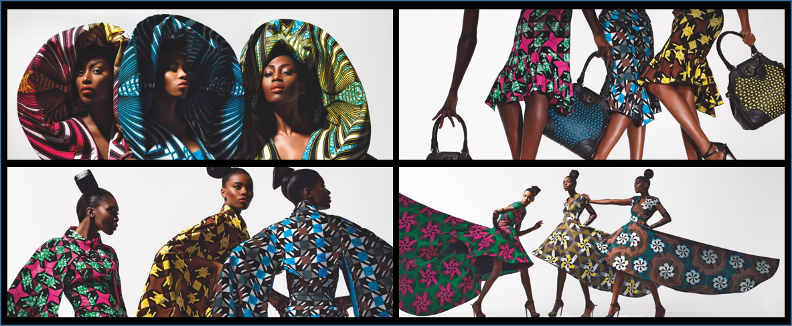

# Wax-MNIST

Le Wax-MNIST est un jeu de données d'images créé pour l'apprentissage en machine. Il est similaire au célèbre jeu de données MNIST, qui contient des images de chiffres manuscrits. Cependant, au lieu de chiffres, les images du Wax-MNIST représentent des motifs colorés trouvés sur des tissus africains, tels que le wax, le kente ou le bogolan. Le Wax-MNIST a été créé pour encourager la diversité culturelle dans les projets IA et sensibiliser à la richesse des motifs africains.

## 0. Contexte

Le pagne ou tissu africain est appelé de différentes manières selon les régions et les pays d'Afrique. Par exemple, en Afrique de l'Ouest, on l'appelle "pagne wax", "pagne africain" ou "pagne imprimé", tandis qu'en Afrique centrale, il est souvent appelé "tissu pagne" ou "tissu africain". Il existe également de nombreux autres noms et appellations pour ces tissus, qui sont souvent associés à des motifs et des designs spécifiques.

Cependant le pagne Wax n'est pas un pagne traditionnel africain comme le Kente, le Bogolan, le Faso Dan Fani ou d'autres pagnes tissés à la main, car il a été introduit en Afrique de l'Ouest par les commerçants hollandais et anglais au XIXe siècle. Cependant, le pagne Wax est devenu très populaire en Afrique de l'Ouest et est maintenant considéré comme un pagne africain emblématique. Les motifs et les couleurs vibrantes du pagne Wax sont souvent associés à la mode et à la culture africaines. Malgré son origine relativement récente, le pagne Wax est devenu une partie importante de la culture vestimentaire africaine et est souvent utilisé pour des occasions spéciales et des événements importants.

## 1. Objectif

Ce jeu de données a été crée dans le cardre du projet [WaxClassification](https://github.com/armelsoubeiga/WaxClassification). L’objectif de ce projet était de fournir à la clientèle du wax africain, un outil d’aide à l’achat des tissus wax sur les marchés. Techniquement, le projet est basé sur l’apprentissage automatique et la classification d’image avec un déploiement du modèle avec Android Studio. En effet, l’application permet de connaître la marque, la qualité, le prix et les recommandations du pagne que vous souhaitez acheter à partir d’une image du tissu/pagne.

## 2. La collecte des images

Les images ont été collectées en ligne sur différents sites d'ecommerce comme : Amazon, Cdiscount, tissusplus.com, ebay, etsy.com, afrikrea.com, ..., et à travers les APIs Google search image et Facebook. La labélisation a été faite à deux niveaux. Un premier niveau automatisé lors de la collecte à partir des mots-clés et de la description produit des e-commerçant. Un deuxième niveau effectué manuellement par l'équipe projet et d'autre collaborateurs.

## 3. Caracteristiques des images

L'ensemble des données actuel est d'environ **1081** image de taille **64 x 64** ou **28 x 28** en **8 categories** de pagnes (tissus).

Il existe sans doute de nombreux types de tissus/pagnes Wax, chacun ayant ses propres motifs, couleurs et styles. Ces données concerne les plus connues :

 * **Vlisco** : Vlisco est l'une des plus anciennes marques de pagne Wax, fondée en 1846. Leurs tissus sont caractérisés par des motifs géométriques et des couleurs vives.
 * **Woodin** : Woodin est une marque de tissus Wax d'origine ghanéenne, connue pour ses motifs contemporains et colorés.
 * **Uniwax** : Uniwax est une marque de tissus Wax basée en Côte d'Ivoire, qui propose une gamme de tissus avec des motifs traditionnels et modernes.
 * **Java ou Hollandais** : Java est une marque de tissus Wax d'origine hollandaise, qui propose une gamme de tissus avec des motifs floraux et abstraits.
 * **GTP (Ghana Textiles Printing)** : Les tissus GTP ont des motifs audacieux et vibrants, souvent inspirés de la nature et de la vie quotidienne. Les couleurs sont souvent vives et les motifs sont parfois en relief.
 * **Real Wax** : Les tissus Real Wax sont produits en Europe et en Asie, mais sont souvent associés à l'Afrique. Ils ont des motifs traditionnels comme les carreaux, les losanges et les étoiles, et sont souvent fabriqués avec des couleurs vives et contrastantes.
 * **Hitarget** : Les tissus Hitarget ont des motifs vibrants et souvent audacieux, avec des couleurs vives et contrastantes. Les motifs sont souvent géométriques et inspirés de la nature.
 * **Batik** : Le batik est une technique de teinture de tissu qui implique l'application de cire sur le tissu pour créer des motifs avant de le teindre. Les tissus Batik peuvent avoir des motifs abstraits ou figuratifs, et sont souvent associés à l'Indonésie.

 
## 4. Les objectifs et tâches possibles

La base de données Wax-MNIST a été créée pour faciliter la Classification automatique des tissus  Wax africains et la Reconnaissance automatique de motifs et de symboles dans les tissus Wax africains. Voici quelques objectifs et tâches possibles pour cette base de données :

* __Reconnaissance de motifs__ : Les motifs dans les tissus Wax africains peuvent avoir des significations culturelles et symboliques importantes. La base de données Wax-MNIST peut être utilisée pour entraîner des modèles de reconnaissance de motifs afin d'identifier et de classifier différents motifs dans les tissus Wax.

* __Classification de tissus__ : La base de données Wax-MNIST peut être utilisée pour entraîner des modèles de classification de tissus afin de différencier les différents types de tissus Wax.

* __Développement d'applications de mode__ : Les modèles de reconnaissance de motifs et de classification de tissus entraînés à l'aide de la base de données Wax-MNIST peuvent être utilisés pour développer des applications de mode, telles que des outils de conception de vêtements ou des applications de recommandation de style basées sur les préférences des utilisateurs.

* __Conservation culturelle__ : Les tissus Wax africains sont un élément important de la culture africaine. La base de données Wax-MNIST peut être utilisée pour aider à documenter et à préserver ces tissus en numérisant et en classant les motifs et les styles de tissus.

* __Éducation__ : La base de données Wax-MNIST peut être utilisée pour sensibiliser les gens aux différents types de tissus Wax africains et à leur signification culturelle. Cela peut aider à promouvoir la diversité culturelle et à lutter contre la marginalisation culturelle.

## 5. Limites

Les données ne sont pas équilibrées et ne sont pas divisées en trains-tests.

## 6. Téléchargement

[Images-id-28x28](https://raw.githubusercontent.com/armelsoubeiga/Wax-MNIST/main/data/data%2028x28.zip)

  

[Images-id-64x64](https://raw.githubusercontent.com/armelsoubeiga/Wax-MNIST/main/data/data%2064x64.zip)

Les données sont également accessibles sur Kaggle par : [Kaggle Link](https://www.kaggle.com/datasets/soubeiga/wax-mnist)

## 7. Projets similaires

[African Fabric Images : Image Dataset of African Fabric Patterns and Textiles](https://www.kaggle.com/datasets/mikuns/african-fabric), mise à la disposition sur kaggel par AYOMIKUN SAMUEL. Ce projet contient environ 1056 images non labellisées.
